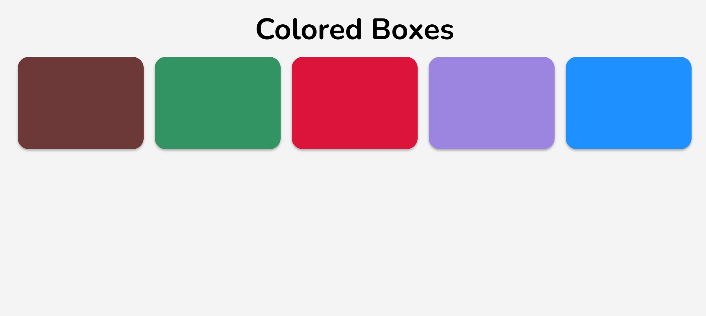

# 💻 Set of Colored Boxes

## ℹ️ A Set of Interactive Colored Boxes Page

A clean, responsive webpage that displays a set of interactive colored boxes using only HTML and CSS.

It was built entirely with HTML and CSS as part of the [**freeCodeCamp.org**](https://www.freecodecamp.org/learn/full-stack-developer/) CSS course.

---

## 🔍 Overview

This project consists of five uniquely colored boxes styled and aligned using modern CSS Flexbox. Each box includes hover animations to emphasize interactivity while maintaining a clean and minimal layout.

The layout adapts fluidly across screen sizes, switching from a horizontal arrangement on larger devices to a vertical stack on smaller screens. The result is a mobile-friendly design that showcases color, spacing, responsiveness, and basic animations.

---

## ✨ Features

- Clean and minimal structure using semantic HTML
- Five uniquely styled colored boxes
- CSS Flexbox layout with responsive behavior
- Smooth hover scaling and shadow effects
- Adaptive mobile layout using media queries
- Custom Google Fonts for modern typography
- Modern CSS variable system for scalable styling

---

## 🧠 What I Learned

- How to use Flexbox to build responsive layouts
- Creating reusable utility classes
- Applying hover effects and CSS transitions
- Managing custom color palettes with CSS variables
- Using media queries for mobile-first design
- Structuring HTML5 for semantic clarity

---

## 🛠️ Tech Used

- HTML5
- CSS3
- Git
- GitHub
- Netlify

---

## 🚀 How to Run

1. Clone the repository
2. Open `index.html` in your browser

---

## 🌐 Live Demo

Or you can check out the 👉 [live website here](https://set-of-colored-boxes-fcc-jiro.netlify.app/)

---

## 🧑‍💻 Author

Created by **Elmar Chavez**

🗓️ Month/Year: **May 2025**

📚 Journey: **2nd** month of learning _frontend web development_.
